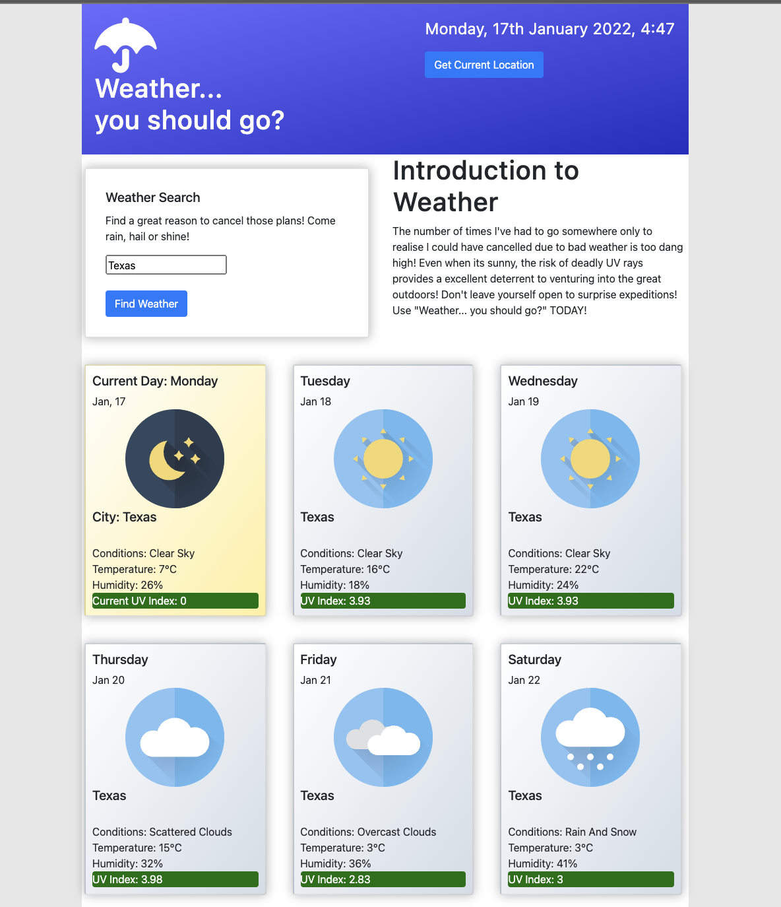

# Links:

Deployed Application: https://brento20.github.io/WeatherApp/

Github Repository: https://github.com/Brento20/WeatherApp

# User Story:

```
AS A traveler
I WANT to see the weather outlook for multiple cities
SO THAT I can plan a trip accordingly
```

## Check List:
|Description | Status |
|--|--|
| Page Loads (lets start with some low expectations) | Done |
|Can Search by city|Done|
|Weather details are displayed| Done|
|5 day future weather is displayed |Done|
|Last search listed| Done |
|UV index changes color based on conditions |Done|
|||

## Criteria:
```
GIVEN a weather dashboard with form inputs
WHEN I search for a city
THEN I am presented with current and future conditions for that city and that city is added to the search history

WHEN I view current weather conditions for that city
THEN I am presented with the city name, the date, an icon representation of weather conditions, the temperature, the humidity, the wind speed, and the UV index

WHEN I view the UV index
THEN I am presented with a color that indicates whether the conditions are favorable, moderate, or severe

WHEN I view future weather conditions for that city
THEN I am presented with a 5-day forecast that displays the date, an icon representation of weather conditions, the temperature, the wind speed, and the humidity

WHEN I click on a city in the search history
THEN I am again presented with current and future conditions for that city
```


# HTML.
1. Using bootstrap for grids.
2. Created cards to display weather.

# .CSS stylesheet planing.

 1. Use bootstrap
 2. use a reset.css
 3. keep it simple

# File structure.

 1. Follow basic guidelines for a clean working repo

# Future improvements.

1. Make last search clickable (I just ran out of time unfortunately)
2. Add some fun hover animations while scrolling over weather cards.
3. Replace Alert error message with a model.
4. Make the current location finder a smoother experience.
5. Add some sort of footer.


Deployed application:



# Credits
1. Weather Icons - Daniel Edesantis
